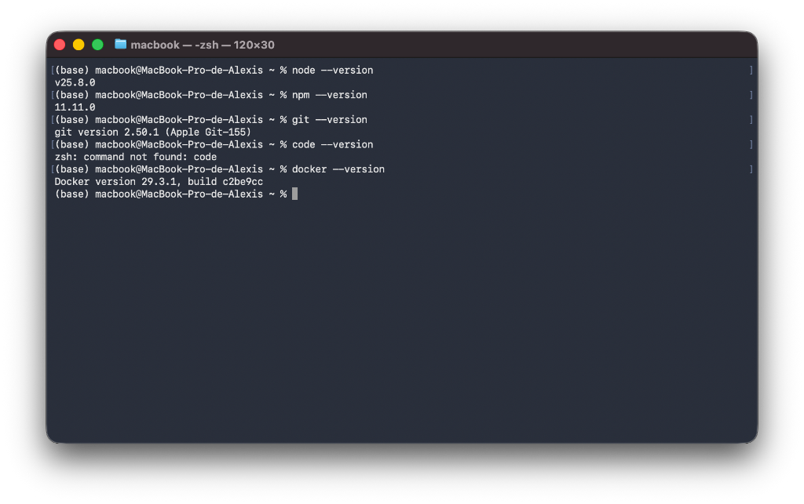
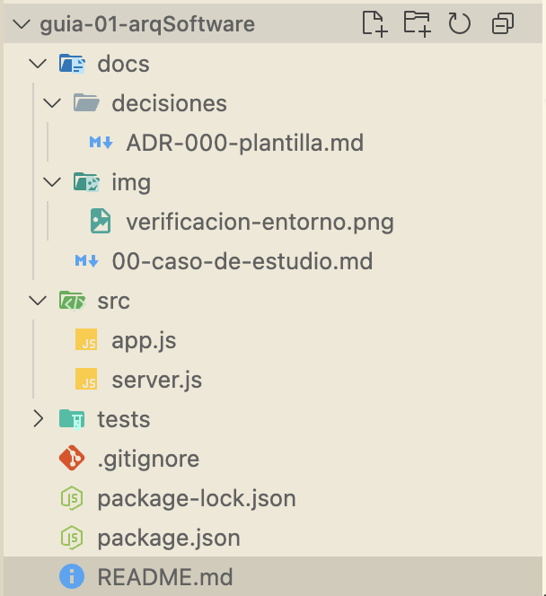

# Guía 01 - Arquitectura de Software

Repositorio correspondiente al laboratorio y guía práctica de Arquitectura de Software.

## Información General

- **Estudiante**: Alexis Huamani Rivera
- **Sección**: ARQUITECTURA DE SOFTWARE [IS-488]
- **Docente**: LIZBETH JAICO QUISPE

---

## Verificación del Entorno de Desarrollo

Se realizó la verificación de las herramientas y versiones requeridas para el laboratorio:

| Herramienta | Versión Instalada |
| :---------- | :---------------- |
| **Node.js** | `v25.8.0`         |
| **npm**     | `11.11.0`         |
| **Git**     | `2.50.1`          |
| **Docker**  | `29.3.1`          |

### Evidencia de Ejecución en Terminal



---

## Estructura del Proyecto


```text
guia-01-arqSoftware/
├── docs/
│   ├── 00-caso-de-estudio.md
│   ├── decisiones/
│   │   └── ADR-000-plantilla.md
│   └── img/
│       ├── estructura-proyecto.png
│       └── verificacion-entorno.png
├── src/
│   ├── app.js
│   └── server.js
├── tests/
├── .gitignore
├── README.md
├── package.json
└── package-lock.json
```

### Evidencia de la Estructura de Carpetas


